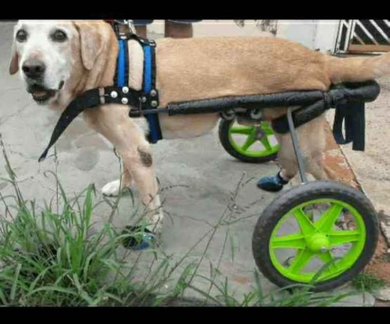
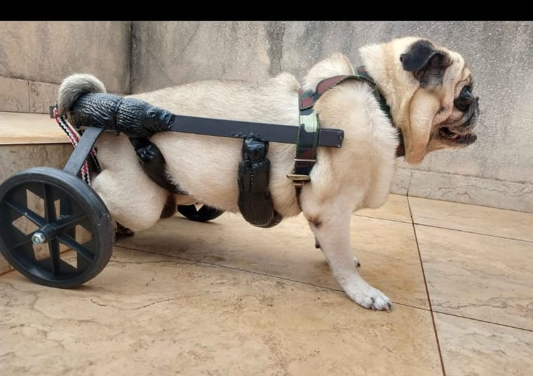

<!DOCTYPE html>
<html lang="pt-br">

<head>

<meta charset="UTF-8">
<title>Ortopets: Cadeiras de Rodas para Cães</title>

</head>

<body>

<h1 class="titulo">Ortopets: Cadeiras de Rodas para Cães</h1>

Informações Necessárias para Enviar à Maurício. Contato: (14)99709-2829

<form id="formulario">

<label>Digite o seu Nome:</label> 
<input type="text" id="nome" required>  

<label>Digite o seu Telefone:</label> 
<input type="text" id="telefone" required>  

<label>Digite o Nome do Cão:</label> 
<input type="text" id="cao">  

<label>Qual é o porte do seu cão?</label> 

<input type="radio" name="porte" value="Grande"> Grande  
<input type="radio" name="porte" value="Médio"> Médio  
<input type="radio" name="porte" value="Pequeno"> Pequeno   

<label>Peso do cachorro:</label> 
<input type="text" id="peso">  

<label>Envie uma foto do cachorro:</label> 
<input type="file">  

<button type="button" onclick="enviarWhats()">Enviar</button>

<button type="reset">Limpar</button>

</form>

</body>
</html>
